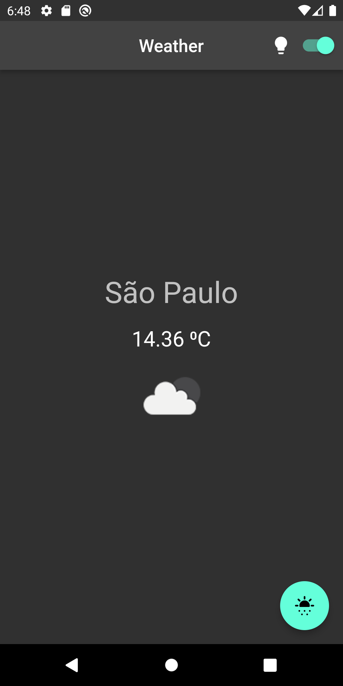

# flutter_architecture_basics

A simple app to exemplify how to structure an app with simple and most common architecture patterns

Structure of the app:
- Model
- View
- Controllers
- ViewModel
- Interfaces
- Repository
- Services

# Screenshot

